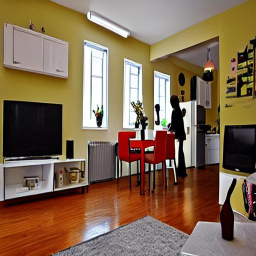
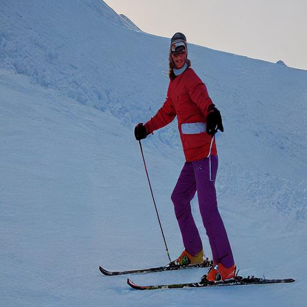
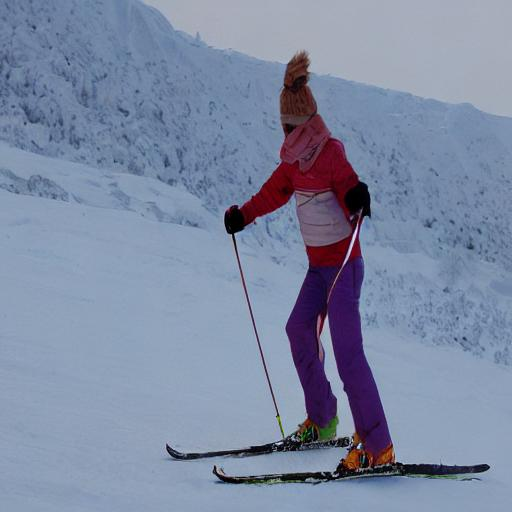

# PLACE: Adaptive Layout-Semantic Fusion for Semantic Image Synthesis (CVPR 2024)

**This is a forked repository from [cszy98/PLACE](https://github.com/cszy98/PLACE/tree/main).**

The original repository works fine with the pre-trained models. However, the training code is not provided, so I'm trying to add the train code based on the original repository and [FreestyleNet](https://github.com/essunny310/FreestyleNet).

Please note that I am not affiliated with the original authors of the paper and cannot guarantee that the code will work as expected or match the results presented in the original paper.

### Updates
Confirmed that the training code works fine with COCO-stuff dataset, on the following Environment:

Ubuntu 22.04, Python 3.11.8, CUDA 12.1, PyTorch 2.2.1, with 2x A100 GPUs.

Results generated (by fine-tuning for only one epoch) using the training code from this repository were compared with the original pre-trained models provided by the authors:
*Original* | *Ours*
:---:|:---:
 | 
 | 


Todo:
- [x] update to compatible with the latest python, pytorch, numpy, transformers, etc.
- [x] Add training code, enabling training from SD1.4 with multiple GPUs.
- [x] Replace the original logger with TensorBoardLogger (just personal preferences), enabling metrics and intermediate results visualization.

### Introduction

A forked repository for the paper "PLACE: Adaptive Layout-Semantic Fusion for Semantic Image Synthesis" (CVPR 2024)

[**[Project Page]**](https://cszy98.github.io/PLACE/)  [**[Official Repository]**](https://github.com/cszy98/PLACE/tree/main)  [**[Paper]**](https://arxiv.org/abs/2403.01852)

### Overview


### Quick Start

#### Dependencies

```
pip install -r requirements.txt
```

#### Data Preparation

Please follow the dataset preparation process in [FreestyleNet](https://github.com/essunny310/FreestyleNet).

#### Inference on Pre-trained Models

The pre-trained models can be downloaded from [GoogleDrive](https://drive.google.com/drive/folders/1b5pC52hasLwm1gOkc9LmdIyxZjrdlNWC?usp=drive_link) and should be put into the `ckpt` folder.

After the dataset and pre-trained models are prepared, you may evaluate the model with the following scripts:

```
# evaluate on the ADE20K dataset
./run_inference_ADE20K.sh
# evaluate on the COCO-Stuff dataset
./run_inference_COCO.sh
```

For out-of-distribution synthesis, you just need to modify the `ADE20K` or `COCO` dictionary in the `dataset.py`

### Training

<!-- The training code is under development. -->
The original pre-trained models of SD1.4 can be downloaded from [here](https://github.com/essunny310/FreestyleNet?tab=readme-ov-file#requirements) and should be put into the `ckpt` folder.

```
# train on the COCO-Stuff dataset
./train_COCO.sh
```

### Citation
Please cite the paper if you find this repository useful for your research.

```
@article{lv2024place,
  title={PLACE: Adaptive Layout-Semantic Fusion for Semantic Image Synthesis},
  author={Lv, Zhengyao and Wei, Yuxiang and Zuo, Wangmeng and Kwan-Yee K. Wong},
  journal={IEEE Conference on Computer Vision and Pattern Recognition},
  year={2024}
}
```